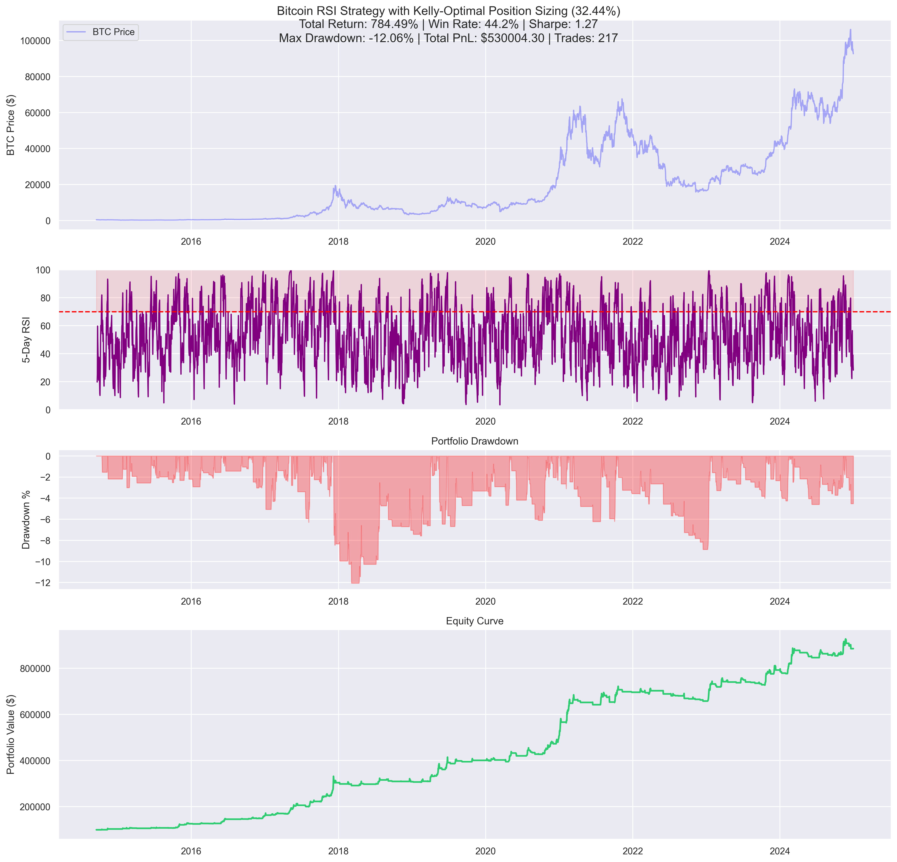

# Bitcoin RSI Trading Strategy

A sophisticated cryptocurrency trading strategy that uses RSI (Relative Strength Index) to identify overbought conditions in Bitcoin, with mathematically optimal position sizing based on the Kelly Criterion.

## Strategy Overview

The strategy implements a mathematically rigorous approach:
- Uses 5-period RSI to identify overbought conditions (RSI > 70)
- Implements Kelly-optimal position sizing (32.44%)
- Maintains a long-only approach with clear entry/exit rules
- Achieved 784.49% return in backtesting ($784,494 total profit)



## Key Features

- **RSI-based Signals**: Short-term (5-period) RSI for quick signal generation
- **Kelly-Optimal Position Sizing**: 
  - Derived from fixed-size backtesting ($100 per trade)
  - Win Rate: 44.24%
  - Average Win: 10.09%
  - Average Loss: 2.14%
  - Win/Loss Ratio: 4.73
  - Kelly Formula: K% = W - [(1-W)/R] = 32.44%
- **Risk Management**: Integrated drawdown monitoring and position size adjustment
- **Performance Analytics**: Comprehensive visualization of trades, equity, and risk metrics

## Requirements

```bash
pandas==2.0.0
numpy==1.24.0
ta==0.10.2
matplotlib==3.7.1
seaborn==0.12.2
yfinance==0.2.36
```

## Installation

1. Clone the repository:
```bash
git clone https://github.com/yourusername/bitcoin-rsi-strategy.git
cd bitcoin-rsi-strategy
```

2. Install dependencies:
```bash
pip install -r requirements.txt
```

## Project Structure

```
├── README.md              # Project documentation
├── requirements.txt       # Python dependencies
├── rsi_strategy.py       # Main strategy implementation
├── fixed_size_analysis.py # Kelly Criterion calculation utility
├── download_bitcoin.py    # Data download utility
├── bitcoin_data.csv      # Historical price data
└── rsi_strategy.png      # Strategy visualization
```

## Usage

1. Download fresh Bitcoin data (optional):
```bash
python download_bitcoin.py
```

2. Verify Kelly Criterion calculation:
```bash
python fixed_size_analysis.py
```

3. Run the main strategy:
```bash
python rsi_strategy.py
```

The strategy will:
- Load Bitcoin price data
- Calculate RSI signals
- Execute the trading strategy with Kelly-optimal position sizing
- Generate performance visualizations
- Output key metrics

## Strategy Performance

Latest backtest results with Kelly-optimal position sizing:
- Total Return: 784.49%
- Win Rate: 44.2%
- Total PnL: $784,494.23
- Total Trades: 217
- Sharpe Ratio: 1.27
- Maximum Drawdown: -12.06%
- Current Drawdown: -4.53%

## Kelly Criterion Implementation

The strategy uses fixed-size backtesting ($100 per trade) to determine the true win rate and win/loss ratio, which are then used to calculate the optimal Kelly fraction:

```
Kelly Formula: K% = W - [(1-W)/R]

Where:
W = Win rate = 44.24%
R = Win/Loss ratio = 4.73

K% = 0.4424 - [(1-0.4424)/4.73]
   = 0.4424 - 0.1180
   = 32.44%
```

This mathematically optimal fraction provides:
1. Maximum geometric growth rate of capital
2. Optimal risk-adjusted returns
3. Mathematically proven position sizing

## Components

### Main Strategy (rsi_strategy.py)
- Implements the core trading logic
- Uses Kelly-optimal position sizing
- Generates performance visualizations
- Calculates key metrics

### Kelly Analysis (fixed_size_analysis.py)
- Performs fixed-size backtesting ($100 per trade)
- Calculates true win rate and win/loss ratio
- Determines optimal Kelly fraction
- Verifies strategy characteristics

### Data Download (download_bitcoin.py)
- Downloads Bitcoin historical data from Yahoo Finance
- Handles data cleaning and formatting
- Saves data to CSV format
- Updates price history through current date

## Risk Warning

This strategy involves trading cryptocurrency with significant position sizes (32.44% of portfolio) based on the Kelly Criterion. While this sizing is mathematically optimal for maximizing geometric growth, it may lead to substantial drawdowns. Consider your risk tolerance and potentially use a fractional Kelly approach for more conservative trading.

## Future Improvements

1. **Risk Management**
   - Implement volatility-based position size adjustments
   - Add trailing stops
   - Consider fractional Kelly implementations

2. **Position Management**
   - Implement scaled entries and exits
   - Add time-based exit rules
   - Consider market regime detection

## License

MIT License

## Contributing

1. Fork the repository
2. Create your feature branch (`git checkout -b feature/amazing-feature`)
3. Commit your changes (`git commit -m 'Add amazing feature'`)
4. Push to the branch (`git push origin feature/amazing-feature`)
5. Open a Pull Request 